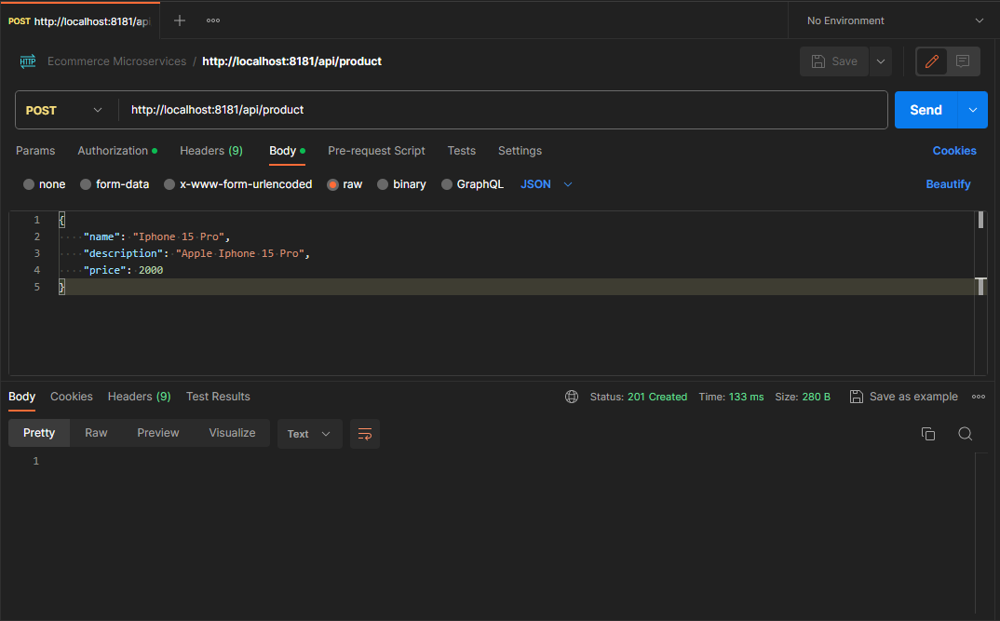
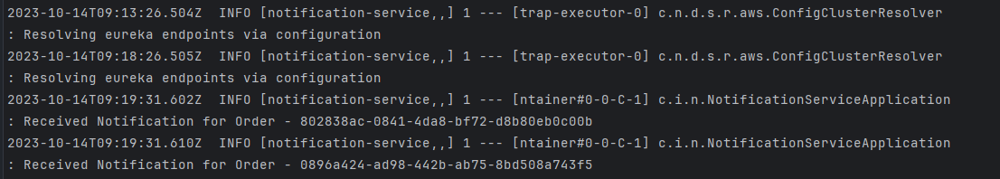
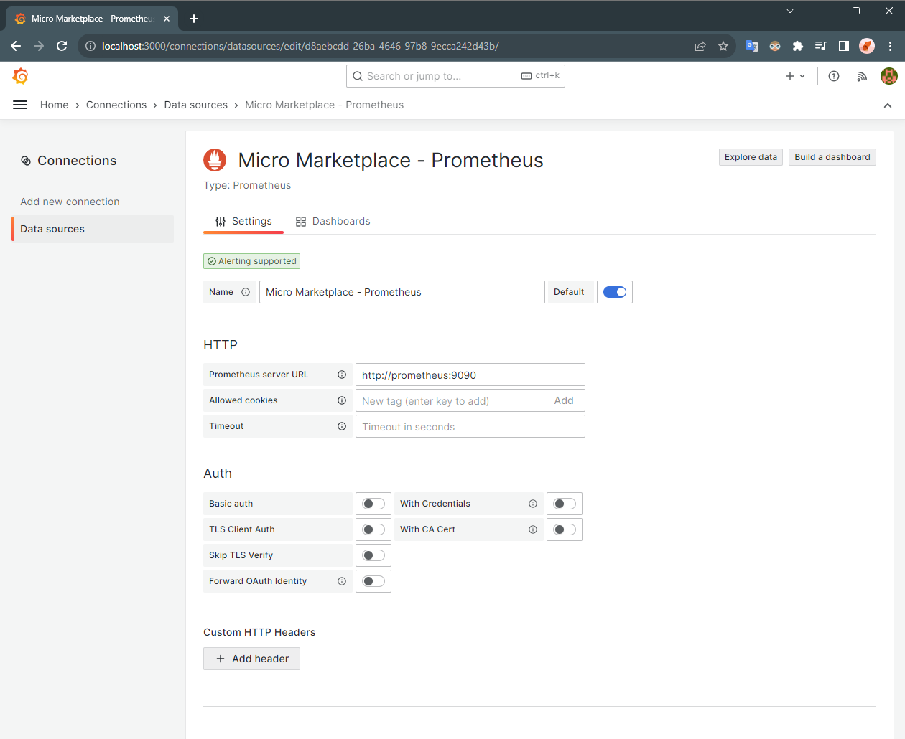

# spring-boot-microservice-new: An E-commerce Microservices Application

## Solution Overview

**spring-boot-microservice-new** is a robust e-commerce platform built on a microservices architecture with **Spring Boot** and open‑source tooling.

- **Service development & discovery:** Spring Boot for services, **Netflix Eureka** for service discovery, and **Spring Cloud Gateway** for API gateway and routing.
- **Security:** **Keycloak** (OIDC/OAuth2) for authentication and authorization using JWT.
- **Communication:** **Resilience4j** for resilient synchronous calls (circuit breaker, retry, rate limiter) and **Apache Kafka** for event‑driven, asynchronous messaging between services.
- **Observability:** **Micrometer** and **Zipkin** for distributed tracing; **Prometheus** and **Grafana** for metrics collection and visualization.

Designed with scalability, resilience, and real‑time processing in mind, **spring-boot-microservice-new** provides a solid foundation for building feature‑rich online marketplaces.


### Solution Architecture


### Services
- **Product Service:** Manages product information, including creation, retrieval, and updates. Uses a **MongoDB** database.
- **Order Service:** Handles order management, including creating and retrieving orders. Uses a **MySQL** database.
- **Inventory Service:** Manages product inventory levels. Also uses a **MySQL** database.
- **Notification Service:** A stateless service responsible for sending user notifications about orders or other updates.

### Major Components
- **Discovery Server:** **Netflix Eureka** is used for service registration and discovery, enabling dynamic communication between microservices.
- **API Gateway:** **Spring Cloud Gateway** serves as the single entry point for all client requests and routes traffic to the correct microservice.
- **Auth Server:** **Keycloak** provides secure authentication and authorization across all microservices.
- **Circuit Breaker:** **Resilience4j** ensures reliability by preventing cascading failures with circuit-breaking mechanisms.
- **Message Broker:** **Apache Kafka** powers the event-driven architecture, handling asynchronous order notifications and other events.
- **Observability Stack:** Distributed tracing with **Micrometer** and **Zipkin** helps track requests across services. **Prometheus** collects metrics, and **Grafana** provides dashboards for performance visualization.

### Tech Stack Used
<div>
    <table>
        <tr>
            <td><strong>Languages & Frameworks</strong></td>
            <td>
                <a href="https://www.java.com/en/" target="_blank">
                    
                </a>
                &emsp;
                <a href="https://spring.io/projects/spring-boot" target="_blank">
                    
                </a>
                &emsp;
                <a href="https://spring.io/projects/spring-cloud" target="_blank">
                    
                </a>
            </td>
        </tr>
        <tr>
            <td><strong>Databases & Message Queue</strong></td>
            <td>
                <a href="https://mongodb.com/" target="_blank">
                    
                </a>
                &emsp;
                <a href="https://mysql.com/" target="_blank">
                    
                </a>
                &emsp;
                <a href="https://kafka.apache.org/" target="_blank">
                    
                </a>
            </td>
        </tr>
        <tr>
            <td><strong>API Gateway</strong></td>
            <td>
                <a href="https://spring.io/projects/spring-cloud-gateway" target="_blank">
                    
                </a>
            </td>
        </tr>
        <tr>
            <td><strong>Service Discovery</strong></td>
            <td>
                <a href="https://spring.io/projects/spring-cloud-netflix" target="_blank">
                    
                </a>
            </td>
        </tr>
        <tr>
            <td><strong>Circuit Breaker</strong></td>
            <td>
                <a href="https://resilience4j.readme.io/" target="_blank">
                    
                </a>
            </td>
        </tr>
        <tr>
            <td><strong>Security</strong></td>
            <td>
                <a href="https://www.keycloak.org/" target="_blank">
                    
                </a>
            </td>
        </tr>
        <tr>
            <td><strong>Observability</strong></td>
            <td>
                <a href="https://micrometer.io/" target="_blank">
                    
                </a>
                &emsp;
                <a href="https://zipkin.io/" target="_blank">
                    
                </a>
                &emsp;
                <a href="https://prometheus.io/" target="_blank">
                    
                </a>
                &emsp;
                <a href="https://grafana.com/" target="_blank">
                    
                </a>
            </td>
        </tr>
        <tr>
            <td><strong>Build & Containerization</strong></td>
            <td>
                <a href="https://maven.apache.org/" target="_blank">
                    
                </a>
                &emsp;
                <a href="https://www.docker.com/" target="_blank">
                    
                </a>
                &emsp;
                <a href="https://github.com/GoogleContainerTools/jib" target="_blank">
                    
                </a>
            </td>
        </tr>
    </table>
</div>


## Getting Started

### Prerequisites
1. Docker and Docker Compose should be installed.
2. Docker should be running.

### Deployment

1. Navigate to the project directory:
   ```shell
   cd spring-boot-microservice-new
   ```

2. Start the containers:
   ```shell
   docker compose up -d
   ```


3. Confirm that the containers are up and running:
   ```shell
   docker ps
   ```


## Usage


### Interacting with Application

- **Getting Credentials from KeyCloak**
  - Access the KeyCloak Admin UI at http://localhost:8080/
  - Go to the Realm `spring-boot-microservices-realm`
  - Go to the Client `spring-cloud-client`
  - Go the the 'Credentials' section, and get the 'Client Secret'


- **Setup Postman Authentication** [Required in the next steps]
  - On the Request page, set Authorization:
    - Type: `OAuth 2.0`
    - Configure New Token with:
      - Token Name: `token`
      - Grant Type: `Client Credentials`
      - Access Token URL: `http://keycloak:8080/realms/spring-boot-microservices-realm/protocol/openid-connect/token`
      - Client ID: `spring-cloud-client`
      - Client Secret: `<client-secret>` (which you copied in the last step from KeyCloak)
    - Click on "Get New Access Token" and then click "Use Token"

    > NOTE: For getting the access token from the keycloak container with the local machine, it is required to add a row with `127.0.0.1 keycloak` in the file: `C:\Windows\System32\drivers\etc\hosts` or `/etc/hosts`  

- **Accessing API Endpoints**
  - **POST /api/product**
    - Method: POST
    - Endpoint: http://localhost:8181/api/product
    - Authorization: Use the OAuth 2.0 token fetched, following the previous step.
    - Body: 
      ```json
      {
         "name": "Iphone 15",
         "description": "Apple Iphone 15",
         "price": 1500
      } 
      ```
    - Output:
        
        
  
  - GET /api/product
    - Method: GET
    - Endpoint: http://localhost:8181/api/product
    - Authorization: Use the OAuth 2.0 token fetched, following the previous step.
    - Output:
        
 
  - POST /api/order
    - Method: POST
    - Endpoint: http://localhost:8181/api/order
    - Authorization: Use the OAuth 2.0 token fetched, following the previous step.
    - Body:
      ```json
      {
         "orderLineItemsDtoList": [
           {
              "skuCode": "iphone_15_pro",
              "price": 2000,
              "quantity": 1
            }
         ]
      }  
      ```
    - Output:
      
      
      

### Components UI

- KeyCloak Admin UI
   - Keycloak UI can be accessed on http://localhost:8080/
   - Realm: `spring-boot-microservices-realm`
     
   - Client: `spring-cloud-client`
    


- Eureka Dashboard
   - Services (Clients) discovered can be viewed on http://localhost:8761/
    


- Zipkin UI
   - Traces for the API calls can be accessed on http://localhost:9411/zipkin/
    


- Prometheus UI
    - Prometheus UI can be accessed on http://localhost:9090/
    - Prometheus Graph Query
      
    - Prometheus Targets Health
      
    - Prometheus Service Discovery Status
      

- Grafana Dashboard
  - Grafana Dashboard can be accessed on http://localhost:3000/
  - To visualize the application, create a 'Data Source' and import the dashboard using `grafana-dashboard.json` file.
  - Data Source
    
  - Dashboard [Collapsed]
    
  - Dashboard
    
    


## Environment Cleanup

- To completely stop and remove the containers and other resources (network, volume, etc.), run the following command:
   ```shell
   docker compose down -v
   ```
---

## Conclusion

**spring-boot-microservice-new** demonstrates how to design and implement a fully functional e-commerce application using a microservices architecture.  
It focuses on **scalability**, **resilience**, and **real-time event-driven communication**, making it an excellent foundation for building production-grade distributed systems.  
With features such as **service discovery**, **API gateway**, **secure authentication**, **circuit breakers**, and a complete **observability stack**, this project can serve as a blueprint for any enterprise-level application.

---

## License

This project is licensed under the **MIT License** – you are free to use, modify, and distribute it with proper attribution.

---

## About the Author

**Abdualimov Botir**  
*Full-stack Java Developer*  

I am passionate about building scalable web applications and distributed systems.  
My expertise includes **Java, Spring Boot, Spring Cloud, REST APIs, React.js, and DevOps practices (Docker, CI/CD)**.  
Feel free to connect with me for collaborations or new opportunities.

- **Email:** botirabdualimov7@gmail.com  
- **LinkedIn:** [https://www.linkedin.com/in/botir-abdualimov-355060259](#)  
- **GitHub:** [https://github.com/AbdualimovBotir](#)
- **Phone:** [+998910256525](#)

---

